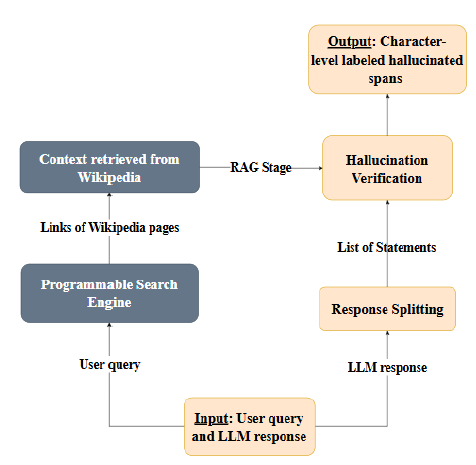

# HalluSearch

**HalluSearch** is a multilingual, search-enhanced pipeline designed to detect and localize hallucinated text spans in outputs from Large Language Models (LLMs). It was introduced as part of [SemEval-2025 Task 3 (Mu-SHROOM)](https://helsinki-nlp.github.io/shroom/) and is described in detail in our paper:

**HalluSearch at SemEval-2025 Task 3: A Search-Enhanced RAG Pipeline for Hallucination Detection**  
[https://arxiv.org](https://arxiv.org)
*(link will be provided soon)*  

## Overview of the System Flow
#### HalluSearch comprises three main components:
### Factual Splitting
- Splits an llm-generated response into **atomic, verifiable statements**.  
- Ensures each claim is independently checked.

### Context Retrieval
- Searches reputable sources (e.g., Wikipedia as in our study) to validate each claim.  
- Employs fallback strategies if no direct or sufficient context is found.

### Hallucination Verification
- Compares each claim against retrieved evidence to identify **factual vs. fabricated segments**.  
- Produces both **hard-label** and **soft-label** annotations for detecting hallucinated text spans.

## Fallback Strategies

When retrieval is incomplete or fails, HalluSearch employs two robust fallback mechanisms:

### Keyword Extraction

- Extracts key terms from the query or statement.  
- Issues a more focused query to the search engine, improving recall for ambiguous or broad queries.

### Language Model Fallback

- Prompts a language model (e.g., GPT-4o) to generate a short contextual passage in the target language.  
- Ensures each claim has at least some baseline reference text if search-based retrieval is insufficient.

---

## Key Strengths of HalluSearch

### Multilingual Coverage

- Evaluated on **14 languages**, including fallback mechanisms to handle limited online resources.

### Fine-Grained Claim Splitting

- Allows for precise verification at the statement level, minimizing false positives or negatives.

### Flexible Retrieval

- Built around a **retrieval-augmented** approach using external knowledge (like Wikipedia) with custom fallback strategies.

### Span-Level Annotations

- Identifies **exact substrings** suspected of hallucination, boosting interpretability and human trust.

### Extensible Architecture

- Adaptable to **new domains or languages** with minimal changes to retrieval sources or prompt design.

---

### Usage
Install requirements from `requirements.txt` and delve through our notebook experiments 

---
## References

- **SemEval-2025 Task 3 (Mu-SHROOM):**  
  [https://helsinki-nlp.github.io/shroom/](https://helsinki-nlp.github.io/shroom/)

